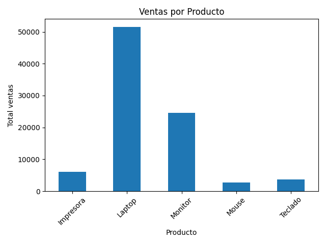

# 📊 Análisis de Ventas con Python

## 🚀 Descripción
Proyecto de análisis de datos donde se procesa información de ventas para generar indicadores clave y visualizaciones.

## 🧠 Lo que hice
- Lectura de datos desde Excel
- Limpieza y transformación de datos
- Cálculo de KPI:
  - Total de ventas
  - Producto más vendido
  - Mejor vendedor
- Visualización con gráficos
- Exportación de reportes automáticos

## 🛠️ Tecnologías
- Python
- pandas
- matplotlib

## ▶️ Cómo ejecutarlo
```bash
pip install pandas matplotlib openpyxl
python analisis_ventas.py
```

## 📈 Resultado
El sistema genera:
- KPI en consola
- Gráfico de ventas
- Archivo Excel con resumen

## 📸 Vista previa


## 👨‍💻 Autor
Alberto Schmalbach
